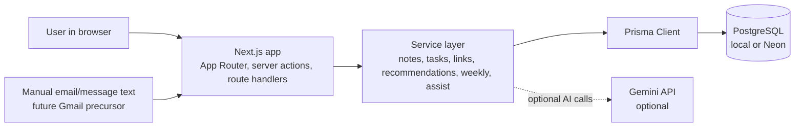
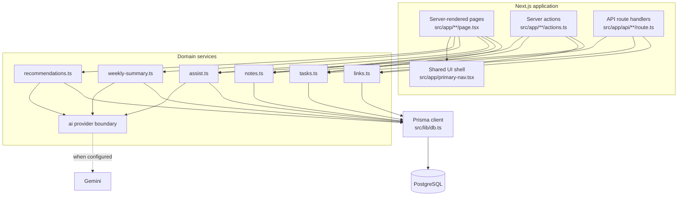
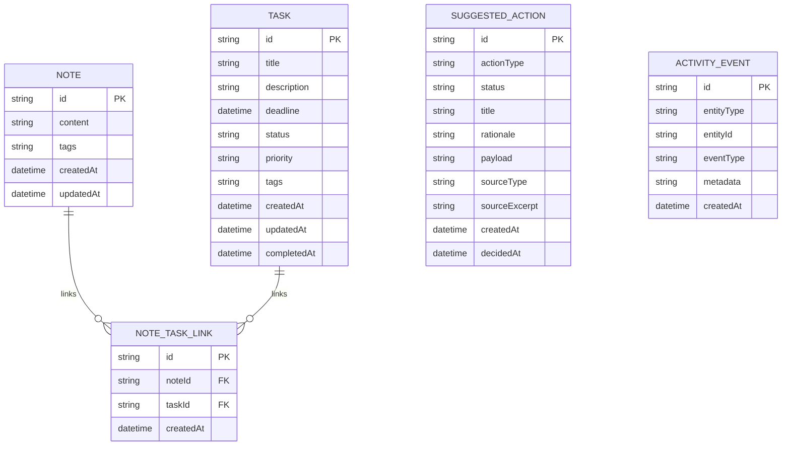
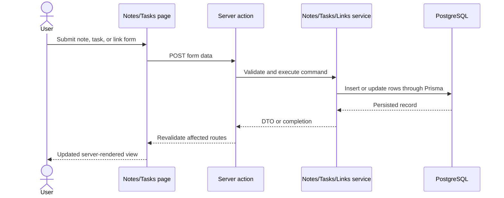
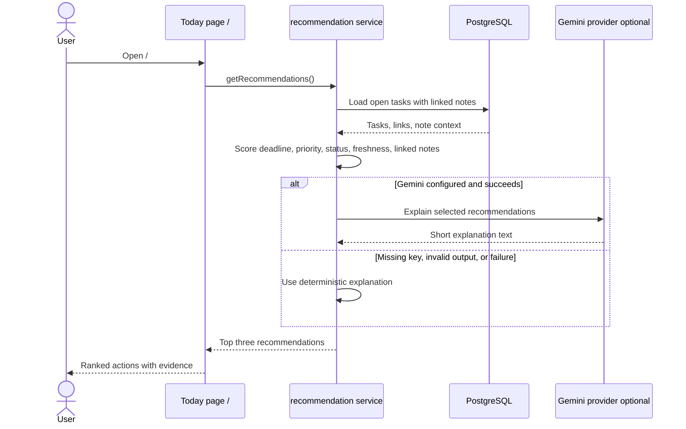
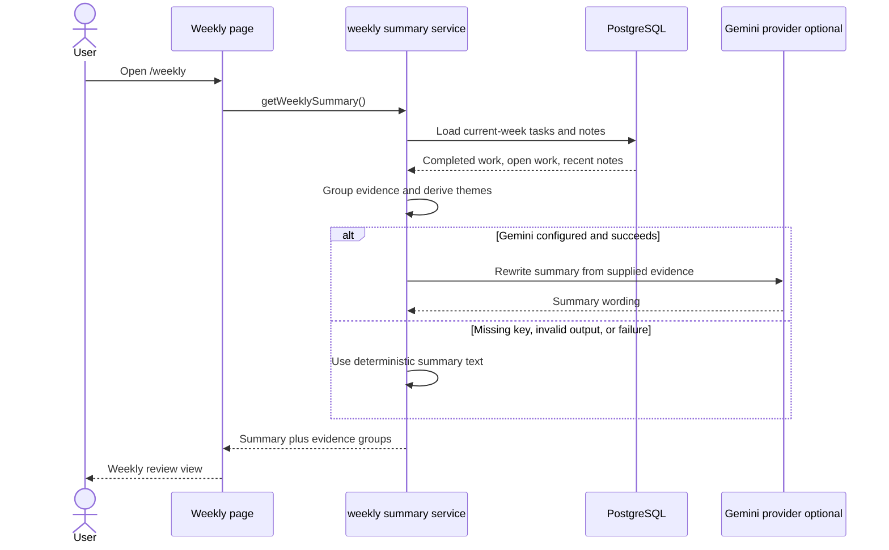
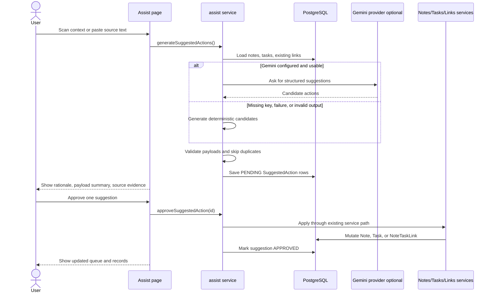
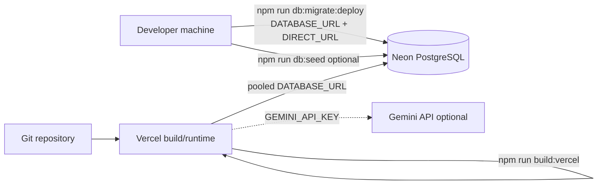

# Architecture

This document explains how the Context-to-Action System is structured, which systems are involved, where AI fits, and what happens during the main user flows.

## Short Version

The app is a full-stack Next.js application backed by PostgreSQL through Prisma. It is intentionally request/response oriented: pages, server actions, and API routes call a small service layer, the service layer reads and writes PostgreSQL, and optional Gemini calls only enhance explanations or propose reviewable actions. Gemini never directly mutates the database.

The core architectural idea is to keep the product useful without AI. Notes, tasks, links, recommendations, weekly summaries, and assist suggestions all have deterministic behavior. AI is an optional enhancement behind `src/server/ai/**`.

## Systems Involved

| System             | Role                                                          | Required?                             | Notes                                                                                    |
| ------------------ | ------------------------------------------------------------- | ------------------------------------- | ---------------------------------------------------------------------------------------- |
| Browser            | User interface for Today, Weekly, Notes, Tasks, and Assist    | Yes                                   | Server-rendered pages with form posts and links.                                         |
| Next.js app        | UI, server actions, route handlers, and backend orchestration | Yes                                   | Runs locally with `npm run dev` or on Vercel.                                            |
| Prisma Client      | Type-safe database access                                     | Yes                                   | Created lazily in `src/lib/db.ts` to keep builds/tests reliable.                         |
| PostgreSQL         | Persistent app database                                       | Yes                                   | Local PostgreSQL for development/tests; Neon works for Vercel.                           |
| Gemini API         | Optional wording and suggestion provider                      | No                                    | Used only when `AI_PROVIDER=gemini` and `GEMINI_API_KEY` are set.                        |
| Vercel             | Deployment target                                             | No for local dev, yes for hosted demo | Builds the Next.js app. Migrations should run separately.                                |
| Manual source text | Email/message import precursor                                | No                                    | Pasted into `/assist`; not a live Gmail integration.                                     |
| Gmail              | Future source system                                          | No                                    | Not currently connected. Future read-only ingestion should feed the same approval queue. |

## System Context

The main boundary to notice is between deterministic services and optional AI. The app can render recommendations, weekly summaries, and assist suggestions even when Gemini is absent or failing.

## Runtime Component Flow

### Why This Shape

- Pages stay thin and mostly compose data for the UI.
- Server actions and route handlers share the same services, so UI and API behavior do not drift.
- Business logic is testable without rendering pages.
- AI providers are injected or discovered at the edge of the service layer, which keeps tests free of live API calls.
- PostgreSQL is the only durable source of truth.

## Data Model

### Model Responsibilities

- `Note` stores captured context.
- `Task` stores commitments and prioritization inputs.
- `NoteTaskLink` is the many-to-many join that makes context reusable across tasks and recommendations.
- `SuggestedAction` stores reviewable AI or deterministic proposals. It is intentionally separate from notes/tasks because pending suggestions are not truth yet.
- `ActivityEvent` is a future hook. The current product does not write workflow events to it yet.

Tags are currently stored as a serialized string and exposed as arrays through service DTOs. Hidden internal seed tags are filtered out by tag helpers so demo ownership metadata does not leak into visible UI.

## Main Flows

### Capture And Linking

Validation happens in the service layer using Zod, so server actions and API routes share the same rules.

### Today Recommendations

The LLM does not choose the ranking. It can only rewrite or improve explanation text for already selected recommendations.

### Weekly Summary

Gemini cannot add unsupported facts because the UI still renders deterministic evidence groups alongside the summary prose.

### Assist Approval Queue

This is the safety-critical flow: a suggestion is not a mutation. A write happens only after the user approves one pending action. Dismissal marks the suggestion as dismissed and does not call the note, task, or link services.

## Does The App Listen To Events?

No. The current implementation does not listen to external event streams, webhooks, queues, or mailbox updates.

The app is request/response driven:

- A user opens a page, submits a form, calls an API route, or runs a script.
- The Next.js app handles that request synchronously.
- Services read/write PostgreSQL and return a result.
- Pages render fresh data on demand.

There are event-like concepts, but they are not active listeners:

- `createdAt`, `updatedAt`, and `completedAt` timestamps provide recency signals.
- `ActivityEvent` exists in the schema as a future extension point, but current workflows do not write to it.
- `SuggestedAction` records decisions in the approval queue, but it is not a background job system.
- Manual email/message import is a user-initiated paste into `/assist`, not Gmail sync.

If real Gmail integration is added later, it should be a separate ingestion boundary that reads messages, converts them into `SuggestedAction` rows, and still requires user approval before creating notes or tasks.

## AI Boundary

AI is isolated behind `src/server/ai/**` and used in three places:

| Feature | Deterministic owner             | Optional AI role                             | Fallback                  |
| ------- | ------------------------------- | -------------------------------------------- | ------------------------- |
| Today   | `src/server/recommendations.ts` | Rewrite recommendation explanations          | Deterministic explanation |
| Weekly  | `src/server/weekly-summary.ts`  | Rewrite summary prose from supplied evidence | Deterministic summary     |
| Assist  | `src/server/assist.ts`          | Propose structured suggested actions         | Deterministic suggestions |

The provider boundary makes AI optional and testable. Integration tests inject fake providers and failure cases instead of calling live Gemini.

## Deployment And Database Operations

For Vercel and Neon, migrations are run outside the Vercel build. This avoids Prisma advisory-lock contention during deploys. The app uses pooled `DATABASE_URL` for runtime queries and direct `DIRECT_URL` for migrations.

For tests, `scripts/prepare-test-db.mjs` points both `DATABASE_URL` and `DIRECT_URL` at the `schema=test` URL before running `prisma db push`. This matters because Prisma `directUrl` can otherwise push to the wrong schema.

## Key Tradeoffs

- Full-stack Next.js keeps the assessment small and easy to review, but it means there is no separate backend service boundary yet.
- PostgreSQL is more setup than SQLite, but it makes local, test, and Vercel deployment paths consistent.
- Deterministic scoring is less flexible than LLM ranking, but it is explainable, testable, and reliable during demos.
- Server-rendered forms are simple and robust, but inline client-side validation is basic.
- Manual email import shows the Gmail direction without OAuth, token storage, background sync, or permission complexity.
- The approval queue slows down automation, but it protects trust and keeps AI from silently changing user data.

## Interview-Ready Answers

### What is the architecture of the app?

It is a full-stack Next.js App Router application. Pages, route handlers, and server actions call a service layer. The service layer owns validation, business logic, deterministic recommendations, weekly summaries, and assist suggestions. Prisma talks to PostgreSQL. Gemini is optional and isolated behind a provider interface.

### Which systems are involved?

At runtime the required systems are the browser, the Next.js app, Prisma Client, and PostgreSQL. Gemini is optional. Vercel and Neon are the hosted deployment path. Gmail is not currently integrated; the app has a manual email-text import path that demonstrates the future ingestion workflow.

### Does it listen to events?

No. It is not event-driven today. It does not consume webhooks, queues, Gmail push notifications, or background sync events. It computes views on demand from persisted notes, tasks, links, and suggestions. `ActivityEvent` is a future hook, not an active event pipeline.

### How does AI fit without taking over decisions?

AI is a helper, not the source of truth. The recommendation ranking and weekly evidence grouping are deterministic. For Assist, AI can propose structured actions, but the service validates the payload and stores it as pending. The user must approve before any write happens.

### What happens if Gemini is unavailable?

The app still works. Today uses deterministic explanation text, Weekly uses deterministic summary prose, and Assist uses local deterministic suggestions. Provider errors, invalid output, and missing keys all degrade without blocking the core workflow.

### What would change for real Gmail integration?

Gmail should be added as a read-only ingestion adapter with OAuth, token storage, permission revocation, polling or push notifications, and noise filtering. The important product rule should stay the same: imported email should create pending `SuggestedAction` rows, not automatic notes or tasks.
