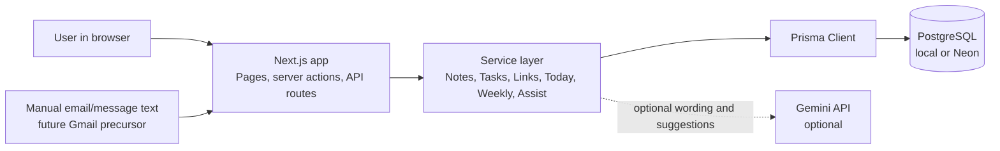

# Context-to-Action System

A small personal knowledge and task system for the Damco build challenge.

The product thesis is simple: capturing notes and tasks is not enough. The useful behavior is deciding what to do next, using the context inside recent notes, deadlines, and task state.

## Challenge Interpretation

I interpreted the assessment as a systems-design exercise, not just a CRUD app exercise. The useful product question is: how can scattered personal context become trustworthy next actions without giving an LLM silent control over the user's data?

The chosen approach is a small context-to-action loop:

1. Capture notes and tasks as separate durable records.
2. Link notes to tasks through a relational join model so context can support more than one commitment.
3. Rank open tasks deterministically using deadlines, priority, status, freshness, and linked context.
4. Use AI only as an enhancement layer for wording or reviewable suggestions.
5. Require explicit approval before any AI-assisted suggestion changes notes, tasks, links, or tags.

That keeps the demo narrow enough to finish well, but rich enough to discuss product tradeoffs, data modeling, AI failure modes, deployment, and future ingestion systems such as Gmail.

## Reviewer Map

- [Architecture](ARCHITECTURE.md): system diagrams, data model, runtime flows, AI boundary, event behavior, deployment shape, and interview-ready answers.
- [Roadmap](ROADMAP.md): phase-by-phase implementation plan, test strategy, and completion notes.
- [QA Checklist](QA_CHECKLIST.md): manual and automated pre-submission checks.
- [Product Audit](PRODUCT_AUDIT.md): product critique, demo risks, future increments, and likely reviewer questions.

## Current Status

Core product slices are implemented and the repo now includes demo seeding for submission prep:

- Root-level Next.js app with TypeScript.
- Prisma plus PostgreSQL for local and Vercel deployment.
- Note and task capture flows with create, list, detail, and update paths.
- Basic tag support across notes and tasks.
- Note-task linking from detail pages using the relational join model.
- Today view with top-three deterministic task recommendations and optional Gemini explanation text.
- Weekly view with deterministic completed-work, carry-forward, recent-note, and theme summaries plus optional Gemini wording.
- Assist view with an approval queue for AI-assisted note/task/link/tag suggestions and manual email-text import.
- Idempotent demo seed flow for reproducible local walkthroughs.
- Hidden internal seed ownership so demo detail pages stay clean while reseeding remains reliable.
- Vitest integration coverage for health, database, notes API, tasks API, link lifecycle behavior, recommendation ranking, weekly summaries, and assist suggestions.
- Production build and lint checks passing for the current slice.

## Stack

- Next.js App Router
- TypeScript
- Prisma ORM
- PostgreSQL
- Vitest for integration testing

### Why This Stack

- Next.js keeps the UI, server actions, and route handlers in one deployable unit, which is appropriate for an assessment-sized product.
- TypeScript makes the service boundaries and DTO shapes explicit enough to discuss during review.
- Prisma gives a readable relational schema and migration workflow without spending the assessment on database plumbing.
- PostgreSQL keeps local development, tests, Neon, and Vercel deployment on the same database model.
- Vitest integration tests exercise the service/API behavior without requiring a browser automation stack for every phase.
- Gemini is isolated behind a provider interface because AI is optional and should not own core ranking or writes.

## Domain Model

- `Note`: captured context in markdown-friendly text.
- `Task`: user commitments with status, deadline, and priority.
- `NoteTaskLink`: many-to-many link between notes and tasks.
- `ActivityEvent`: event log that later phases can use for recency and summaries.
- `SuggestedAction`: reviewable AI/deterministic suggestions that only mutate data after approval.

## Architecture Overview

- `src/app/**`: App Router pages, route handlers, and server actions.
- `src/server/notes.ts`, `src/server/tasks.ts`, and `src/server/links.ts`: application logic for capture and linking.
- `src/server/recommendations.ts`: deterministic Today ranking plus optional AI explanation replacement.
- `src/server/weekly-summary.ts`: deterministic Monday-to-now weekly summary plus optional AI wording replacement.
- `src/server/assist.ts`: suggested-action queue for links, tags, notes, and tasks with explicit approval before writes.
- `src/server/ai/**`: small Gemini boundary so AI can enhance wording and propose actions without owning core decisions.
- `src/lib/db.ts`: lazy Prisma client setup with PostgreSQL connection validation.

The app is request/response driven today. It does not listen to external event streams, webhooks, queues, Gmail push notifications, or background sync events. `ActivityEvent` exists as a future schema hook, but current workflows compute views on demand from persisted notes, tasks, links, and suggested actions.

For the deeper systems view, including sequence diagrams and data-model diagrams, see [Architecture](ARCHITECTURE.md).

## Getting Started

1. Copy `.env.example` to `.env`.
2. Install dependencies with `npm install`.
3. Point `DATABASE_URL` at a PostgreSQL database that local development and Vercel can reach.
4. If you use Neon or another provider that offers separate pooled and direct URLs, set `DIRECT_URL` to the direct non-pooled connection string for Prisma migrations.
5. Generate Prisma client with `npm run db:generate`.
6. Apply checked-in migrations with `npm run db:migrate:deploy`.
7. Load demo data with `npm run db:seed`.
8. Start the app with `npm run dev`.

The example `.env.example` uses a local PostgreSQL URL. For Neon, use the pooled connection string as `DATABASE_URL` and the direct non-pooled connection string as `DIRECT_URL` so runtime traffic and migrations each use the right connection type.

`npm run db:seed` is idempotent. It removes previously seeded demo records, including older demo rows that used the legacy visible content marker, and recreates a known walkthrough state.

## Scripts

- `npm run dev`: start the local development server.
- `npm run build`: create a production build.
- `npm run build:vercel`: build the app for Vercel without running migrations during the build.
- `npm run lint`: run the ESLint checks.
- `npm run test`: prepare the test database and run the integration tests.
- `npm run test:watch`: prepare the test database and watch the test suite.
- `npm run db:generate`: regenerate Prisma client.
- `npm run db:migrate`: run Prisma migrations against the active database URL.
- `npm run db:migrate:deploy`: apply committed migrations without creating a new one.
- `npm run db:push`: push the schema without creating a migration.
- `npm run db:seed`: load reproducible demo data into the active database URL.
- `npm run db:studio`: inspect the database locally.

## Environment Variables

- `DATABASE_URL`: Prisma connection string for the app database.
- `DIRECT_URL`: direct PostgreSQL connection string used by Prisma migrations. For Neon, this should be the direct non-pooled URL.
- `TEST_DATABASE_URL`: optional PostgreSQL connection string for the test schema. If unset, tests reuse `DATABASE_URL` with `schema=test`.
- `GEMINI_API_KEY`: optional Gemini key for AI-assisted recommendation explanations, weekly summary wording, and assist suggestions.
- `AI_PROVIDER`: optional provider selection flag. Leave unset or use `gemini` for the built-in provider.
- `NEXT_PUBLIC_APP_NAME`: display name used by the app and health route.

## Demo Flow

1. Run `npm run db:migrate:deploy` and `npm run db:seed`.
2. Open `/` and show the seeded urgent task rising to the top because of deadline, priority, in-progress status, and linked context.
3. Open the linked task and note detail pages to show the relationship is part of the persisted model, not a UI-only suggestion.
4. Return to `/weekly` and show completed work, carry-forward tasks, recent notes, and theme counts for the current week.
5. Open `/assist`, scan current context, and show that suggested links or tags wait for explicit approval before any data changes.
6. Paste a sample email or message into `/assist` and show it becomes reviewable note/task suggestions rather than an automatic import.
7. Explain that the product still works without Gemini because deterministic ranking, weekly grouping, and assist fallbacks remain available.
8. If a Gemini key is available, refresh `/`, `/weekly`, or generate assist suggestions and point out that AI proposes wording or actions while deterministic services still own validation and writes.

## Live Demo Posture

The project is Vercel-ready and intended to be deployed with Neon PostgreSQL for review. The repository includes `vercel.json`, a Vercel-safe build command, PostgreSQL migrations, seed data, and environment-variable documentation.

For submission, provide reviewers with:

- The Vercel URL.
- The GitHub repository URL.
- A note that Gemini is optional; the app remains usable without `GEMINI_API_KEY`.
- A short reminder that demo data can be recreated with `npm run db:seed` if the hosted database is reset.

## Vercel Deployment

1. Provision a Neon PostgreSQL database.
2. In Neon, copy both connection strings:
   - the pooled connection string for app runtime queries
   - the direct non-pooled connection string for migrations
3. In Vercel, set:
   - `DATABASE_URL` to the pooled Neon URL
   - `DIRECT_URL` to the direct Neon URL
   - `NEXT_PUBLIC_APP_NAME`
   - `AI_PROVIDER=gemini`
   - `GEMINI_API_KEY` if you want AI wording enabled
4. Before the first deploy, and any time the Prisma schema changes later, run `npm run db:migrate:deploy` against Neon from your machine or CI using the same `DATABASE_URL` and `DIRECT_URL` values.
5. Deploy the repo. `vercel.json` runs `npm run build:vercel`, which only builds the app and does not attempt to acquire Prisma's migration advisory lock during the Vercel build.
6. After the first deploy, run `npm run db:seed` against the hosted database if you want the same reviewer-ready demo data in production.

For Neon specifically, keeping `DATABASE_URL` pooled and `DIRECT_URL` direct avoids migration issues during runtime, but the safest deployment flow is still to run Prisma migrations outside the Vercel build so concurrent deployments do not contend on Prisma's advisory lock.

## Tradeoffs and Failure Modes

- PostgreSQL makes the app deployable on Vercel and keeps local and hosted schemas aligned, but it raises setup cost compared with SQLite.
- Ranking and weekly summaries are heuristic and explainable; they are easier to defend than full LLM-controlled prioritization, but weaker when data is sparse.
- The app is intentionally server-rendered and simple to keep the implementation legible during review, at the cost of richer client-side interactions.
- AI outages or missing keys degrade to deterministic fallback wording and local assist suggestions instead of blocking the product.
- The assist flow reduces manual organization work, but it still requires one approval per suggestion; that is slower than automation and safer for an assessment demo.
- Manual email-text import demonstrates the Gmail direction without adding OAuth token storage or mailbox permissions yet.
- Weekly summaries use local server time for the Monday-to-now window, which is acceptable for the demo but would need explicit user timezone handling in a production version.
- There is no authentication or multi-user ownership model yet, so this should be presented as a personal single-user MVP.
- There is no background worker or queue; all suggestions and summaries are generated by explicit user requests.

## Future Improvements

Given two more weeks, the next increments would be:

1. Add a read-only Gmail connector that feeds imported messages into the existing `SuggestedAction` approval queue.
2. Add authentication and per-user ownership before any real mailbox or personal-data deployment.
3. Add search and filters across notes, tasks, tags, linked status, and suggestion source.
4. Promote `ActivityEvent` into a real event log written by note/task/link/suggestion workflows.
5. Add background ingestion with a small job queue only after the approval-queue safety model is stable.
6. Add timezone-aware weekly summaries and richer inline form validation.

The key future-design constraint is that external data sources should propose actions, not silently create or modify user records.

## Iteration And Commit History

The project was built in focused phases: foundation, capture, linking, recommendations, weekly summary, submission polish, deployment readiness, and AI Assist approval queue. The intended commit style is small, reviewable commits such as `feat: add recommendation engine` or `fix: move neon migrations out of vercel build`.

Before final submission, the latest documentation and Assist changes should be committed as one coherent documentation/product slice or split into one feature commit plus one docs commit, depending on how much review granularity is desired.

## QA Directions

Run automated validation first:

1. `npm run test`
2. `npm run lint`
3. `CI=1 npm run build`

Then run `npm run db:migrate:deploy`, `npm run db:seed`, `npm run dev`, and smoke-test the seeded demo:

1. Open `/` and verify the seeded urgent task appears in Today recommendations.
2. Open `/weekly` and verify the page shows at least one completed task, recent notes, carry-forward work, and themes.
3. Open a linked task detail page and a linked note detail page from the seeded data and verify the relationship appears on both sides without any internal demo marker text in the editable fields.
4. Open `/assist`, generate suggestions from current context, approve one low-risk tag or link suggestion, and verify the target note/task changed only after approval.
5. Paste an email-like message into `/assist`, approve the drafted note or task, and verify the created record appears in `/notes` or `/tasks`.
6. Leave `GEMINI_API_KEY` empty and verify `/`, `/weekly`, and `/assist` still show deterministic fallback behavior.
7. Optional AI smoke test: set `AI_PROVIDER=gemini` and `GEMINI_API_KEY`, restart the dev server, and verify AI can change wording or suggestions without bypassing the approval step.

If you want a fuller manual feature regression after the seeded demo pass:

1. Open `/api/health` and verify the response includes `status`, `service`, and `timestamp`.
2. Open `/notes`, create a note with content, create another with comma-separated tags, and verify both appear in the list.
3. Open a note detail page, update its content or tags, save, reload, and verify the update persists.
4. Open `/tasks`, create a task with only a title, and verify it appears with `TODO` status and `MEDIUM` priority.
5. Open a task detail page, update deadline, priority, tags, and status to `IN_PROGRESS`, save, reload, and verify the update persists.
6. Change a task status to `DONE` and verify it remains visible in the task list but is excluded from Today recommendations.
7. Create at least one note and one task, open the note detail page, link the task, and verify the linked task appears on the note.
8. Open the linked task detail page and verify the note appears in linked notes.
9. Unlink from either detail page and verify the relationship disappears from both sides.
10. Open `/assist`, dismiss a pending suggestion, and verify it moves out of the pending queue without changing notes or tasks.

## Submission Readiness

The repo is currently in submission-ready shape for the assessment:

- Setup, seed, and QA steps are documented for a fresh reviewer.
- The demo seed flow is deterministic and keeps internal ownership markers out of the visible UI.
- The database layer now uses PostgreSQL so the same schema can run locally and on Vercel.
- The Assist page shows Gemini/deterministic suggestions as reviewable actions instead of automatic writes.
- Malformed JSON API requests now fail with stable `400` responses instead of generic `500`s.
- Missing note/task detail reads still render not-found pages, while unexpected runtime failures surface through the app error boundary.
- The detailed phased plan and implementation history live in `ROADMAP.md`, and the working conventions live in `AGENTS.md`.
